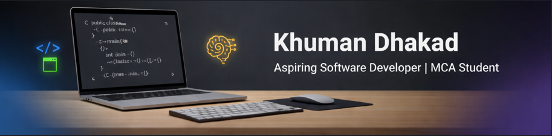

<!-- ===================== HERO SECTION ===================== -->

  

<h1 align="center">Hi 👋, I'm Khuman Dhakad</h1>
<h3 align="center">Aspiring Software Developer | MCA Student | Building with Code & Creativity</h3>

  <em>
    I don’t just learn technologies — I build with them, break them, and rebuild them better.
  </em>

  
  
  

---

## 🧠 About Me  

🎓 MCA student with a strong interest in **software development and problem-solving**.  
💻 Currently mastering **C, Java, and Data Structures & Algorithms**.  
🚀 Focused on building **real, practical projects** instead of just theory.  
🎨 I combine **technical thinking with creativity**, which reflects in my projects and content work.  

> My goal is simple:  
> **Become a highly skilled developer who can build, scale, and explain systems clearly.**

---

## 🛠️ Tech Stack  

### 💻 Languages  
- C  
- Java (Foundational → Intermediate)

### 🧩 Core CS  
- Data Structures & Algorithms  
- Problem Solving  
- Logical Thinking  

### 🌐 Web  
- HTML  
- CSS  

### 🔧 Tools & Platforms  
- Git & GitHub  
- VS Code  
- GCC / Command Line  

---

## 📂 Featured Projects  

### 🧑‍🎓 Student Management System (C)  
> A console-based system using structures, file handling, and modular programming.  
**Focus:** logic building, memory understanding, clean C practices.

### 🌐 Art & Creative Web Projects  
> Minimal, clean websites built using HTML & CSS for creative experimentation.

### 🤖 AI Cartoon Content Experiments  
> Exploring how AI + storytelling + creativity can build engaging digital content.

---

## 📈 What I’m Working On Now  

- Strengthening **DSA fundamentals**  
- Writing **clean, readable C code**  
- Learning how real software is structured  
- Improving **technical English & communication**  
- Preparing for **MNC placement opportunities**

---

## 🎯 Long-Term Vision  

- Become a **strong backend / system-oriented developer**  
- Build projects that solve real problems  
- Grow into a developer who can **design + explain systems**  
- Achieve a high-impact role in a reputed tech company  

---

## 📬 Let’s Connect  

- 🌍GitHub: https://github.com/khuman-dhakad

---

  <strong>✨ Consistency beats motivation. Building every day. ✨</strong>

